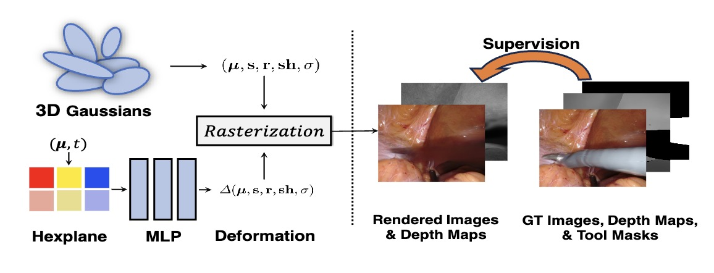

# EndoGS: Deformable Endoscopic Tissues Reconstruction with Gaussian Splatting

This is the official code for https://arxiv.org/abs/2401.11535.

## Overview



## Installation

Clone this repository and install packages:
```
git clone https://github.com/HKU-MedAI/EndoGS.git
conda env create --name gs --file environment.yml
conda activate gs
pip install git+https://github.com/ingra14m/depth-diff-gaussian-rasterization.git@depth
pip install git+https://github.com/facebookresearch/pytorch3d.git
```
Note: for the submodule diff-gaussian-rasterization of the [3D-GS](https://github.com/graphdeco-inria/gaussian-splatting), we use the depth branch of https://github.com/ingra14m/depth-diff-gaussian-rasterization.

## Dataset

We use the dataset in [EndoNeRF](https://github.com/med-air/EndoNeRF). Download the data from their website.

Use [COLMAP](https://demuc.de/colmap/) to estimate the initial point clouds. Store the files (`cameras.bin, images.bin, points3D.bin`) in the data path (e.g., `./data/cutting_tissues_twice/sparse/`).

## Training
```
python train.py {data path} --workspace {workspace}
## e.g.,
python train.py data/cutting_tissues_twice/ --workspace output/cutting/
```

## Inference
```
python inference.py {data path} --model_path {model path}
## e.g.,
python inference.py data/cutting_tissues_twice/ --model_path output/cutting/point_cloud/iteration_60000
```

## Evaluation
```
python eval_rgb.py --gt_dir {gt_dir path} --mask_dir {mask_dir path} --img_dir {rendered image path}
## e.g.,
python eval_rgb.py --gt_dir data/cutting_tissues_twice/images --mask_dir data/cutting_tissues_twice/gt_masks --img_dir output/cutting/point_cloud/iteration_60000/render
```
Note: we should use the same masks in training and evaluation. If the name 'gt_masks' exist, we use 'gt_masks'; if not, use 'masks'. And we exclude the unseen pixels in gt and rendered images for PSNR.

## Citation

If you find our work useful, please kindly cite as:
```
@article{zhu2024deformable,
  title={EndoGS: Deformable Endoscopic Tissues Reconstruction with Gaussian Splatting},
  author={Zhu, Lingting and Wang, Zhao and Cui, Jiahao and Jin, Zhenchao and Lin, Guying and Yu, Lequan},
  journal={arXiv preprint arXiv:2401.11535},
  year={2024}
}
```

## Acknowledgement
* The codebase is developed based on [3D-GS](https://github.com/graphdeco-inria/gaussian-splatting) (Kerbl et al.), [4D-GS](https://github.com/hustvl/4DGaussians) (Wu et al.), [SuGaR](https://github.com/Anttwo/SuGaR) (Guédon et al.), and [EndoNeRF](https://github.com/med-air/EndoNeRF) (Wang et al.).
